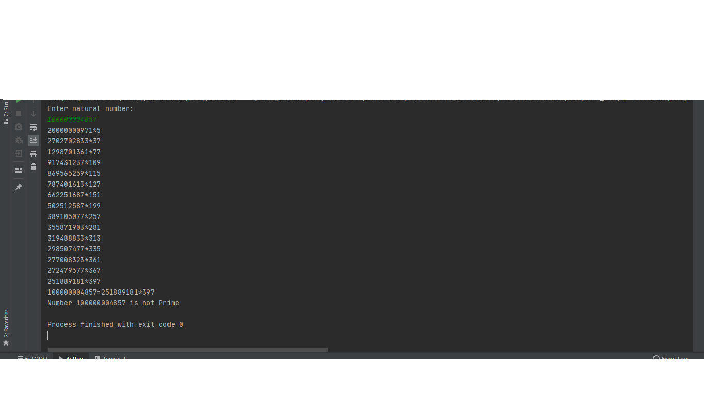
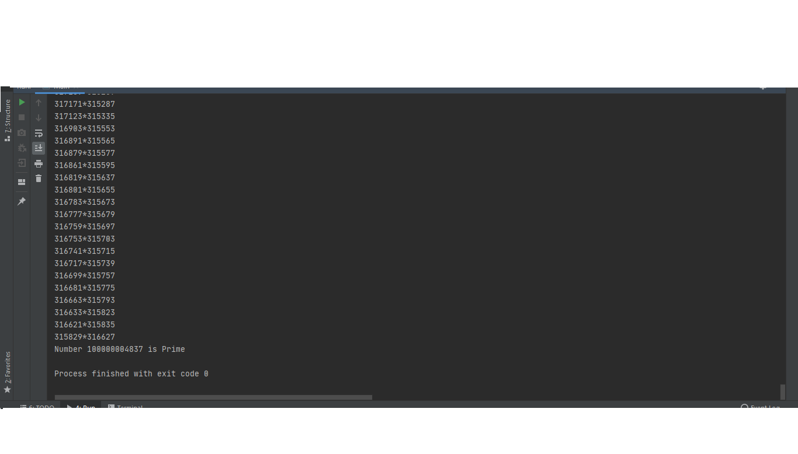

# Primality-test
Algorithm for determining whether an input number is prime.
This program good works for numbers less than 1 000 000 000 000 000.
For greater numbers the calculations are getting longer.
 
 
